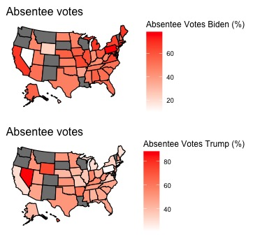
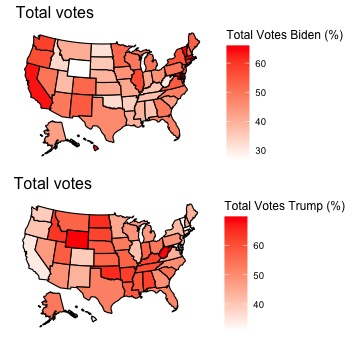

# 2020-Presidential-Election Results
The 2020 Presidential Election was definately a night (or should I say week) to remember. Not only did this voting event broke several records from past elections, it also has the most in depth data to this date. I'm going to show you some insights I found in this phenomenon.

The Data: 
To begin the analysis, I used the New York Times Presidential Election Dataset as my source. The 

From the data it shows that Biden supporters are more likely to do absentee votes than Trump Supporters in election.

We can see in the total popularity votes how strong the candidates recieve votes in each state. We can see how states who have a strong connection to their favored party (democrats or republican) continue to stick with their previous choice in the past. 

